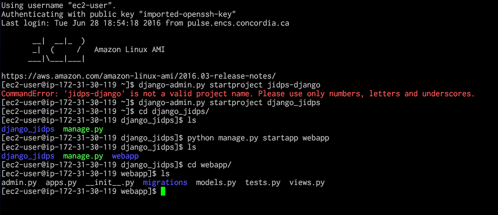
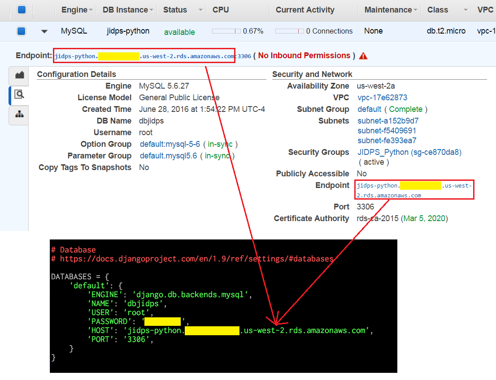
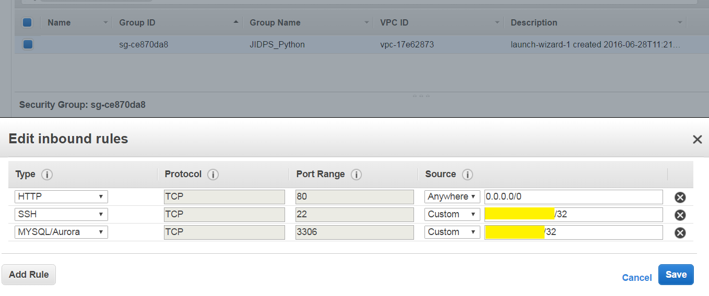

# Install Django on AWS EC2 with RDS

* Author: Suo Tan (tandysony AT gmail DOT com)
* Created: June 28, 2016
* Last updated: June 28, 2016

---

## 1. Initialize an EC2 instance and a MySQL Database instance on AWS. Please make sure that the two instance is using the *same privacy group* as the EC2 instance.

## 2. [Install MySQL on AWS EC2]
#### [Install MySQL on AWS EC2](http://docs.aws.amazon.com/AWSEC2/latest/UserGuide/install-LAMP.html). You can also check the [video tutorial series here](https://www.youtube.com/watch?v=FEnLnjnBw9I) as a reference. As a quick summary, the following commands are essential:
>    `sudo yum install -y mysql55-server`

>    `sudo mysql_secure_installation`

Start mysql when system To ensure that the database server launches after a reboot, you must enable the chkconfig utility. Use the following commands to enable chkconfig on MySQL:
>    `sudo chkconfig mysqld on`

Or you need to start mysql manually:
>    `sudo service mysqld start`

## 3. Install `Python-pip` and `django`
#### 3.1 Install python with its package management system - *pip*:
>    `sudo yum install python-pip`

**NOTE**: The latest version of `python-pip` and its dependent packages will be installed.

#### 3.2 Install `django`:
>    `sudo pip install django`

#### 3.2 Test your install.
  Check the python version:
>    `python --version`

  Check the django version:
>    `from django import get_version`
>    `get_version()`

  You will be popped with your installed python version, e.g., `Python 2.7.10` and `1.9.7`

## 4. Create a django project
#### 4.1 Create a project named `django_jidps`
>    `django-admin.py startproject django_jidps`

#### 4.2 Create your application named `webapp` under the project directory
>    `cd django_jidps/`

>    `python manage.py startapp webapp`

#### 4.3  Verify your application has been successfully created
>    `cd webapp/`

>    `ls`

Here is a snapshot of the process creating a django project.

#### 4.4 Edit the `settings.py` file to link the project to your RDS database instance. Be sure that the `HOST` is be the **endpoint** of the RDS isntance, `NAME` is the **DB Name** and `USER` is the **Username** are correct.

#### 4.5 Add two more rules to the *Inbound rules* for the `Security Groups` associated with this DB Instance as follows. The *source* for *MYSQL/Aurora* rule is the `internal IP` for your EC2 Instance. `HTTP` rule allows public access for your application. You can also check the [video tutorial here](https://www.youtube.com/watch?v=tv7ZMftorjM) as a reference.

#### 4.6 Run the command bellow and you are ready to go.
>    `ls`

## 5. Using FileZilla to upload local website
#### 5.1 Load the .ppk/.pem file, and use your EC2 instance[Check the video tutorial here](https://www.youtube.com/watch?v=e9BDvg42-JI)
  > `Host:` sftp://XXX-XX-XX-XX.us-west-2.compute.amazonaws.com

  > `Username:` ec2-user

#### 5.2 Upload all your local website to the website directory on AWS (`/var/www/html/jidps/`, in my case)

## 6. Import your backup databse to RDS instance [critical to syn your website]
#### 6.1 Use phpMyAdmin to export your website database as a `*.sql` file.

#### 6.2 Use FileZilla to upload the backup file to a directory (`/var/www/html/jidps/***/backup`, for example) on AWS server.

#### 6.3 Go to the backup folder
>  `cd /var/www/html/jidps/***/backup`

#### 6.4 Stop mysql of the AWS instance
>  `sudo service mysqld stop`

#### 6.4 Stop mysql of the AWS instance
>  `sudo service mysqld stop`

### [You may skip the following steps (6.5-6.8), since AWS hosted Drupal database alway threw `duplicate primary key errors`, if import backup database to the RDS database directly.]

#### 6.5 Connect to your Amazon RDS DB instance as a remote host
>    `mysql -h xxxxxxxx.xxxxxxxxxxx.us-west-2.rds.amazonaws.com -P 3306 -u root -p`

#### 6.6 Drop the used database
> `mysql> DROP [dbname];`

#### 6.7 Create a database with the same one dropped
> `mysql> CREATE [dbname];`

#### 6.8 Exit the RDS instance
> `mysql> exit;`

#### 6.9 Import backup database to RDS
>  `mysql -h xxxxxxxx.xxxxxxxxxxx.us-west-2.rds.amazonaws.com -P 3306 -u root -p drup532 < drup532.sql`

## 7. Some Commands to Manipulate an Amazon RDS DB instance
#### 7.1 Connect to your Amazon RDS DB instance as a remote host
>    `mysql -h xxxxxxxx.xxxxxxxxxxx.us-west-2.rds.amazonaws.com -P 3306 -u root -p`

#### 7.2 Run MySQL command line for operations
  * List all the databases in the instance
  > `mysql> SHOW DATABASES;`

  * Select a database
  > `mysql> USE [dbname];`

  * Show all tables within the selected database
  > `mysql> SHOW TABLES;`

  * Drop a database
  > `mysql> DROP [dbname];`

  * Create a database
  > `mysql> CREATE [dbname];`

  * Exit the RDS instance
  > `mysql> exit;`

## 8. Some common Linux Commands
#### 8.1 Change permission:
    `chmod 775 -R [directory]`

#### 8.2 Check permission for all the files and directories:
    `ls -ld`

#### 8.3 Remove a file:
    `rm [fileName]`

#### 8.4 Romve a directory:
    `rm -r [directory]`

#### 8.5 change name of a folder:
    `mv [folderName_A] [folderName_B]`

#### 8.6 Install and uninstall phpmyadmin on AWS:
    `sudo yum --enablerepo=epel install phpmyadmin`
    `yum erase phpmyadmin`

#### 8.7 Searching with `nano` command: `Ctrl` + `W` is the shortcut for searching. To repeat the search: `Alt` + `W`

#### 8.8 Configure phpMyAdmin
    `sudo nano /etc/phpMyAdmin/config.inc.php`
