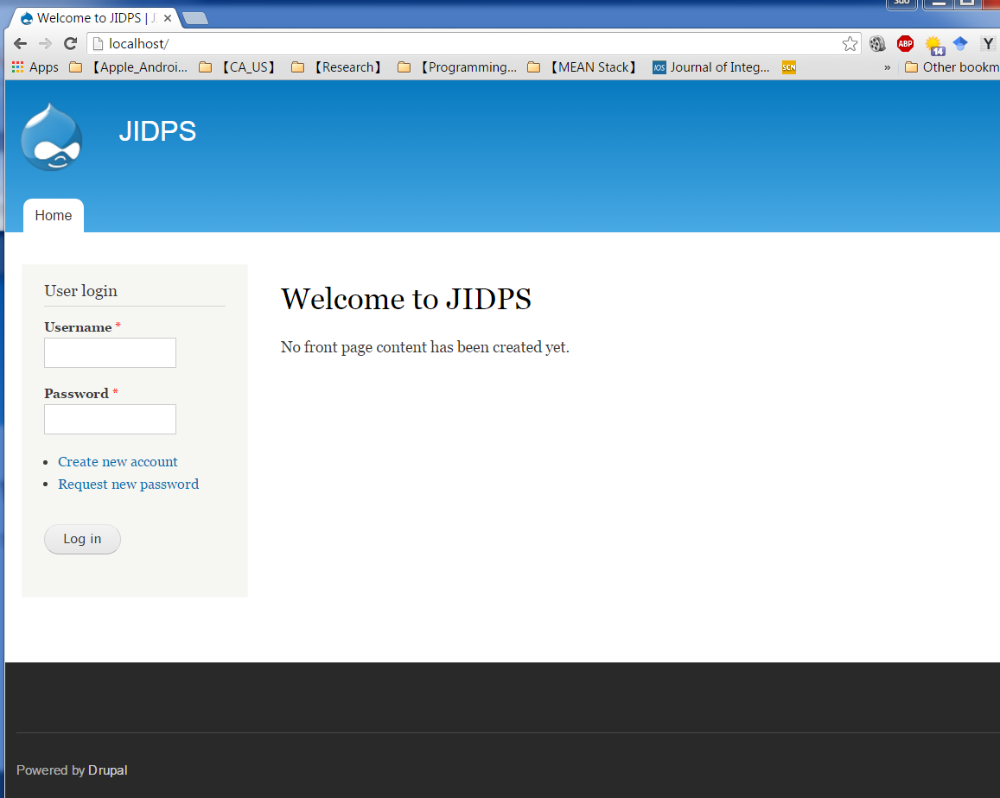

# Install Drupal on AMPPS

* Author: Suo Tan (tandysony AT gmail DOT com)
* Created: Dec. 2, 2015
* Last updated: Jan. 11, 2016

---

## Requirements
1. AMPPS
2. Drupal 7
3. Window 7/8/10 or Mac OS X or Linux

#### 1. Download and install AMPPS
 * Download [AMPPS](http://www.ampps.com/)
 * Install it on your PC or Mac

#### 2. Run the AMPPS and start Apache and MySQL

 

#### 3. Go to `AMPPS Home` by clicking the *House icon* in the image above or right-clicking AMPPS icon, then go to `AMPPS Home`

 

#### 4. Search for `Drupal` in the search bar, and then click `Install`

 

#### 5. Configure Drupal settings other than the defaults
 * **5.1.** `Drupal 7.41` is chosen since majority of the modules are not ported to Drupal 8 as of the time of writing.  
 * **5.2.** For `In Directory`, leave it blank if you are going to host ONLY one website, or a meaningful name (e.g., `loc.jidps.com`) for possible multiple website. I left it blank just for simplicity. *[You can change it later if you left it blank at the beginning]*
 * **5.3.** Use `JIDPS` for `Site Name`.
 * **5.4.** In `Advanced Options`, choose a proper name (lower case is recommanded) for `Database Name`, e.g., `jidps` is used in this case. In AMPPS, the default database username is `root` and default database password is `mysql`. They are critical for later website sync among multiple computers. They cannot be changed here at installing phase, but can be later.
 * **5.5.** Use a rarely used email for `Admin Email` and/or `Email installation details to:` field(s).

 

#### 6. Click `Install` and you will be notify once completed.

 

#### 7. Launch your local website one installed successfully

 * Click the installed link `http://127.0.0.1` or input `http://localhost/` your web browser to see your local webpage. Please note that, if you input a directory name in `Step 5.2`, you need to include it as well, e.g. `http://127.0.0.1/loc.jidps.com` or input `http://localhost/loc.jidps.com`

 

#### 8. Start to develop your website
 * Input your **Admin username** and **Admin Password** set in `Step 5` to start develop.
