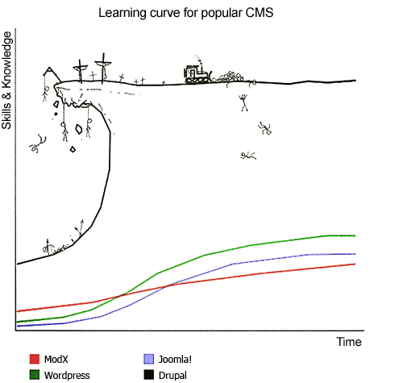
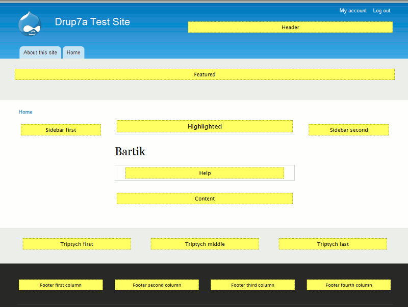
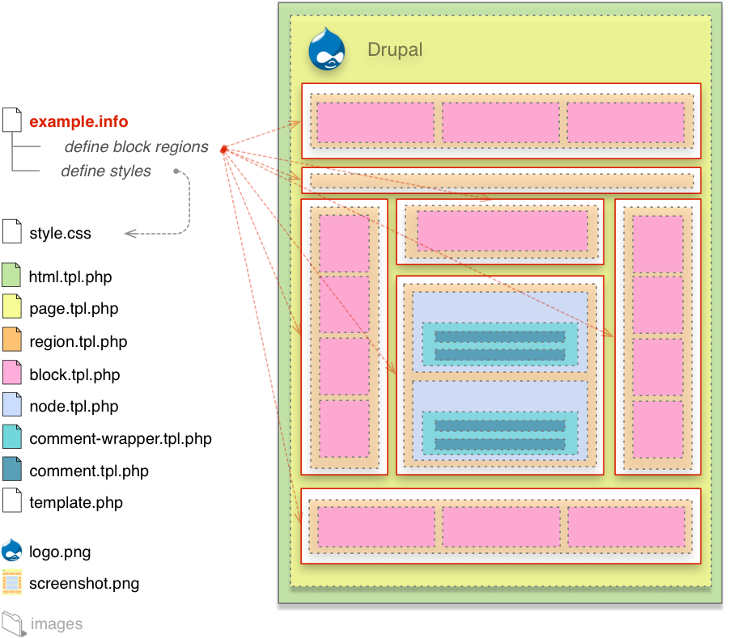
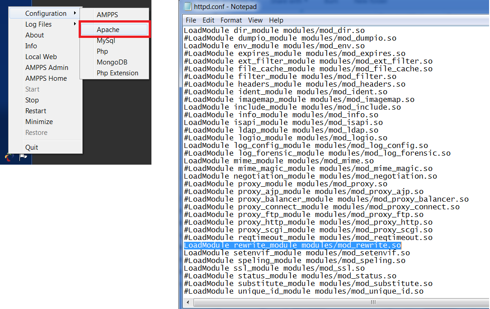
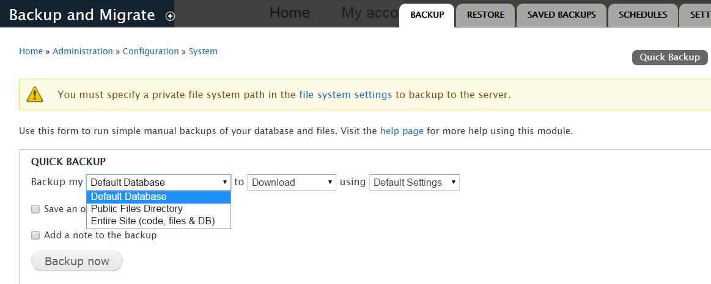
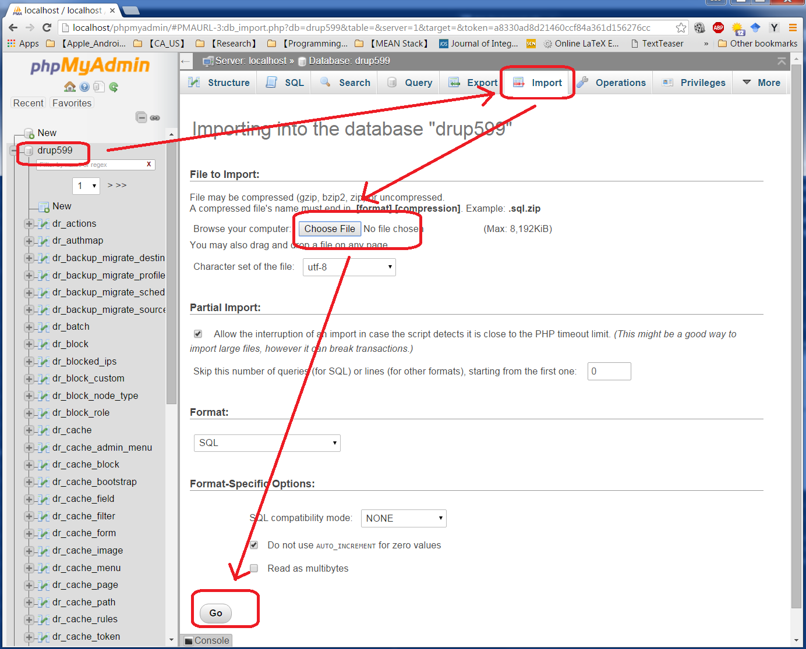
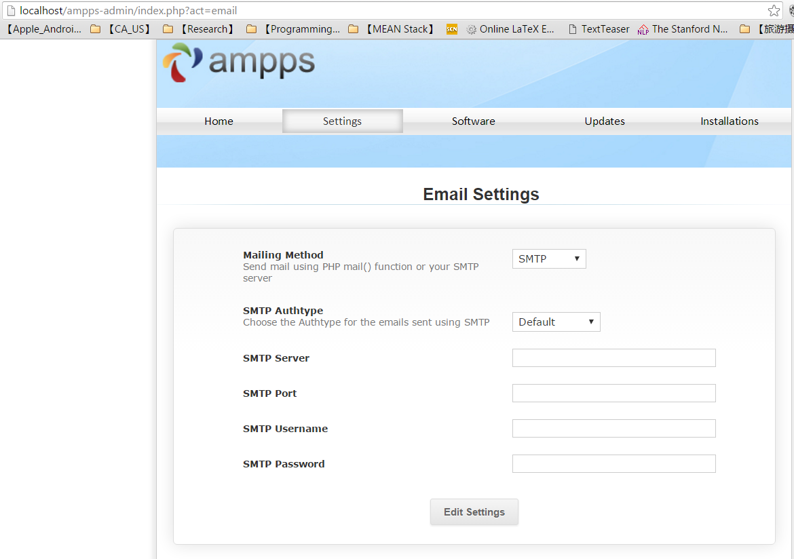

# Web Development with Drupal 7

* Author: Suo Tan (tandysony AT gmail DOT com)
* Created: Dec. 3, 2015
* Last updated: March. 18, 2016

---

## Prerequisite
1. AMPPS installed
2. Drupal 7 installed
3. Courage and persistence (learning Drupal can be very painful)

 

## Website Development with Drupal
In this demo, website folder is named `loc.jidps.com`.

### 1. Drupal 7 blocks and region structure
 * A webpage structure in Drupal 7 is shown in the following figure

   

### 2. Themes
 * Download [themes](https://www.drupal.org/project/project_theme)

   

### 3. Modules
 * Unzip your theme and modules, and put them under the respective folder (`themes` or `modules`) under the `loc.jidps.com/sites/all` folder.
 * Some must have modules for Drupal 7:

    * [Pathauto](https://www.drupal.org/node/17345)
    * [Token](https://www.drupal.org/project/token)
    * [CTools](https://www.drupal.org/project/ctools)
    * [Views](https://www.drupal.org/project/views)
    * [CKEditor](https://www.drupal.org/project/ckeditor)
    * [Module Filter](https://www.drupal.org/project/module_filter)
    * [Media](https://www.drupal.org/project/media)
    * [Administration menu](https://www.drupal.org/project/admin_menu)
    * [Entity API](https://www.drupal.org/project/entity)
    * [Backup and Migrate](https://www.drupal.org/project/backup_migrate)

### 4. Views
 * Understand the core concept `View` in Drupal: [View - Formats & Pagers](https://www.youtube.com/watch?v=uDWs0ij6Dt0&index=25&list=PL15BE2E8313A4E809)

### 5. Taxonomy
 * xxx
 * To configure multi-layer taxonomy pattern, go to `Configuration` --> `Search and metadata` --> `URL aliases` --> `TAXONOMY TERM PATHS`: under `Default path pattern`, fill in `[term:vocabulary]/[term:parents:join-path]/[term:name]`

### 6. [Drupal's database system]()

##### 6.1. General database terms
 * There are three big pieces that need to exist before we have a useful database abstraction layer.
     * **The connection**. How is a connection established, maintained, and closed?
     * **The query**. How is a query built and sent to the database?
     * **The result**. How are query results returned in a format which we can use?

Thankfully, [PDO](http://php.net/manual/en/intro.pdo.php) ("PHP Data Objects") exists for `PHP`, which has stock solutions for each of those three. There are two classes here that we need to be aware of.

* **The `PDO` class** handles creating, maintaining, and closing the **connection** between PHP and whatever database you're using.
* **The `PDOStatement` class** handles **querying the database** (using "prepared statements" which is where the name comes from) as well as **returning results**.

That's it. Those are the two major pieces of `PDO`, and you can see that each of our three major pieces in the list above above are addressed in one of those two classes.

*Note: there are more `PDO` classes than just those two. There is also a `PDOException` class and some driver classes for different databases, for example, but those aren't important for the purposes of our understanding right now.

Congratulations, you know enough about `PDO` to understand how Drupal is using it! In fact, a lot of `PDO` will look familiar to you if you've done some querying with Drupal. For example, `fetchAll()` and `rowCount()` are core functions of the `PDOStatement` class.*

##### 6.2. What Drupal's doing
Here are the big three DB-related classes in Drupal, all of which live along with a few others in `includes/database/database.inc`:
* **[DatabaseConnection](https://api.drupal.org/api/drupal/includes%21database%21database.inc/class/DatabaseConnection/7)** - extends the `PDO` class to manage the connection
* **[DatabaseStatementBase](https://api.drupal.org/api/drupal/includes%21database%21database.inc/class/DatabaseStatementBase/7)** - extends the `PDOStatement` class to send queries and fetch results
* **[Database](https://api.drupal.org/api/drupal/includes%21database%21database.inc/class/Database/7)** - a standalone class that isn't meant to be instantiated or extended, which contains some functions used to manage the connection with `DatabaseConnection` without having to resort to global variables (this will make more sense later).

And then we have the classes for specific query types, which live in `includes/database/query.inc`:
* **[Query](https://api.drupal.org/api/drupal/includes%21database%21query.inc/class/Query/7)** - base class that doesn't do much on its own
* **[InsertQuery](https://api.drupal.org/api/drupal/includes%21database%21query.inc/class/InsertQuery/7)** - extends the `Query` class for `INSERT` queries
* **[UpdateQuery](https://api.drupal.org/api/drupal/includes%21database%21query.inc/class/UpdateQuery/7)** - extends the `Query` class for `UPDATE` queries
* **[DeleteQuery](https://api.drupal.org/api/drupal/includes%21database%21query.inc/class/DeleteQuery/7)** - extends the `Query` class for `DELETE` queries
* **[MergeQuery](https://api.drupal.org/api/drupal/includes%21database%21query.inc/class/MergeQuery/7)** - extends the `Query` class for `MERGE` queries
* **[TruncateQuery](https://api.drupal.org/api/drupal/includes%21database%21query.inc/class/TruncateQuery/7)** - extends the `Query` class for `TRUNCATE` queries
* **[SelectQuery](https://api.drupal.org/api/drupal/includes%21database%21select.inc/class/SelectQuery/7)** - extends the `Query` class for `SELECT` queries. *Note that this one is special enough to exist in its own file (`includes/database/select.inc`) with its own `interface` to go along with it.*

And to close the loop, since this is supposed to be a summary after all, here's the general process (at a VERY high level, even though it may not seem like it):
1. A query function such as [db_select()](https://api.drupal.org/api/drupal/includes%21database%21database.inc/function/db_select/7) is called when a query is being requested.
2. That function will call the [getConnection()](https://api.drupal.org/api/drupal/includes%21database%21database.inc/function/Database%3A%3AgetConnection/7) method of the Database class which will fetch the DB driver and connection info from `settings.php`.
3. Once we have the connection info, we can instantiate the database driver class for our chosen database, such as [DatabaseConnection_mysql](https://api.drupal.org/api/drupal/includes%21database%21mysql%21database.inc/class/DatabaseConnection_mysql/7), and hand it our connection info.
4. The driver class constructor function will call the class's parent constructor (i.e., `DatabaseConnection`'s constructor) which calls its own parent's constructor (i.e., `PDO`'s constructor), which creates and returns the connection.
5. Back in the `db_select()` function with a connection in hand, we can use function chaining to instantiate the `SelectQuery` class on top of it and build the query object.
6. Any other functions chained after our original `db_select()`, such as `condition()` or `range()` or `orderBy()`, will be functions inside our query class (i.e., `SelectQuery`) and will alter the instantiated query object's attributes.
7. The [execute()](https://api.drupal.org/api/drupal/includes%21database%21select.inc/function/SelectQuery%3A%3Aexecute/7) method of the `SelectQuery` class runs, which converts our query object to a SQL string, and runs it through [query()](https://api.drupal.org/api/drupal/includes%21database%21database.inc/function/DatabaseConnection%3A%3Aquery/7) method of the `DatabaseConnection` class
8. That ends up running the [execute()](https://api.drupal.org/api/drupal/includes%21database%21database.inc/function/DatabaseStatementBase%3A%3Aexecute/7) method of the DatabaseStatementBase class
9. Finally, *that* function runs the `execute()` method if its parent class, which is `PDOStatement`, which actually executes the query against the target database.
10. Our query has run, and we can fetch results using one of many `fetch*()` functions provided by `PDOStatement` and `DatabaseStatementBase`.


###### For more detailed information, read the [database chapter](http://www.drupaldeconstructed.com/content/04-database.html) in the book [Drupal 7 Deconstructed](https://www.gitbook.com/book/mcrittenden/drupal-7-deconstructed/details).


## On Use
 * set and configure **roles**: `People` --> `Permissions` --> `Roles`
 * set and configure **categories**: `Structure` --> `Taxonomy`
 * set and configure **status**: `Configuration` --> `Workbench` --> `States`
 * configure **transations**: `Configuration` --> `Workbench` --> `Transations`

## Some thoughts
#### 1. Use `custom menu` for role selection
#### 2. Use [Workbench Suite](https://www.drupal.org/documentation/modules/workbench) for JIDPS website development. Here is an [introduction tutorial](https://modulesunraveled.com/workbench)
#### 3. Using `rules` and `Workbench_moderation`
 * **Event**: `After saving new content` (also tried `after moderation transition`)
 * **Conditons**: `Content is using workbench moderation` and `contents current moderation state`.
 * **Actions**: send mail `node:author:mail` (that the new content has been moderated and published)
 * **Data Viz**: visualize data.

## Frequent Q/As

#### 1. Having `?q=` in URLs even with `Pathauto` module enabled?
 * You need to make sure `LoadModule rewrite_module modules/mod_rewrite.so` in the `httpd.conf` file is uncomment out, no leading `#`.

    

* Go to `http://localhost/loc.jidps.com/?q=admin/config/search/clean-urls` and check `Enable clean URLs`

#### 2. `CKEditor V4.5.X` could not be detected by `wysiwyg v7.x-2.2` module?
  * Open `\sites\all\libraries\ckeditor\ckeditor.js` file in a text editor.
  * Add `// version:'4.4.3',revision:'4391'` in first line and save it.

#### 3. Sync a localhost website to multiple machines?

> **Do NOT fully rely on the `Backup and Migrate` module to sync your entire website among multiple machines. Too shame that Drupal released the `Backup and Migrate module (7.x-3.1)` that is not functional well at the time of writing (Jan. 12, 2016), even with patches applied. It raised all kinds of issues all over the Internet. Hereby, I provide a way to baypass the restore function. I have tested this on two PCs running Windows 7 64-bit and one Macbook Pro running OS X El Capitan. It works like a charm.**

 > **Please also be noted that the sync process is based on the `AMPPS` software, to ensure that database version and structure (i.e., table prefix) are exactly the same across all computers, no matter running MAC OS, Windows or Linux.**

  * **3.1.** Backup your database and website

  * The `Back and Migrate` module does not work with `Entire Site (code, files & DB)` restore option. Here is my solution:
    1. Use the `Back and Migrate` module to `Download` the `Defualt Database` (NOT `Entire Site (code, files & DB)`).

        

    2. Copy the database backup file (e.g., `xxx.mysql.gz`) and your entire drupal website folder (all files under the `..\Ampps\www` directory) to your USB drive or a cloud drive (e.g., Google Drive, Dropbox).
    3. Visit your `phpMyAdmin` page on a different computer, choose your current database (`drup599` in this case) being used for Drupal website development, and `Import` from your database backup file (`xxx.mysql.gz`). Then paste you whole website into you new local `www` folder.

        

    4. Open the `settings.php` file under the directory `www\sites\default\`. Be sure that `databse ==> xxx` has the same name of current local database (`drup599` in this case). Change the values to `username` and `password` to `root` and `mysql` respectively.
        ```php
        $databases = array (
        'default' =>
          array (
            'default' =>
            array (
              'database' => 'drup599',
              'username' => 'root',
              'password' => 'mysql',
              'host' => 'localhost',
              'port' => '',
              'driver' => 'mysql',
              'prefix' => 'dr_',
            ),
          ),
        );
        ```

    5. Then visit your website and click `Flush all cashes` from the top tool bar. You are now synced your website between two machines.


#### 4.  How to configure AMPPS to to send out email from localhost?
   * **4.1.**  Go to your [local mail settings in AMPPS](http://localhost/ampps-admin/index.php?act=email).

   

   And, then configure as followings:
    * `Mailing Method`: `SMTP`
    * `SMTP Server` : `ssl://smtp.gmail.com`
    * `SMTP Port` : `465`
    * `SMTP Username` : Your Gmail Email Address
    * `SMTP Password` : Password of your Gmail Account
