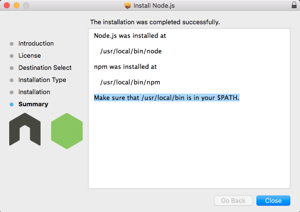

# Web Development Practice

 > **LEARN, PRACTICE AND BUILD!**

* Author: Suo Tan (tandysony AT gmail DOT com)
* Created: Dec 18, 2015
* Last updated: Jan 14, 2016

---

# 1. The roles of web technologies

The most widely used web technologies/languages are HTML, CSS, JavaScript, PHP, MySQL, ASP.NET, MS SQL Server. Others like JAVA, Ruby, Python, MangoDB, etc. are also available to choose from. The following table presents the roles of several technologies/languages, taking HTML, CSS, JavaScript, PHP, Node.js, MySQL, MongoDB as examples.

| Technologies/Languages  | Roles     | Where it runs   |
| --------------|:---------------:|:---------------:|
| HTML          | Content and Structure   *(tex, images, tables, forms, etc)*    | Browser   |
| CSS           | Style and Presentation  *(color, fonts, background, margins, paddings, etc)*     | Browser   |
| JavaScript    | Client Side Scripting   *(dynamic user interaction, popups, form validation)*     | Browser   |
| PHP, Node.js           | Server Side Scripting    *(server side logic and data processing)*    | Server    |
| MySQL, MangoDB         | Data Management    *(store all sorts of data needed by a website)*          | Server    |

# 2. Basic technologies/languages

### * HTML

### * CSS

 CSS (Cascading Style Sheets) is a style sheet language that describes the presentation of an HTML (or XML) document. CSS describes how elements must be rendered on screen, on paper, or in other media. The reason why we use CSS to separate the presentation layer of our page way from functional part that we may use JavaScript to add rich functionality to the page and markup as well.

* Use `#` to target a `ID` defined in HTML files; use `.` to target a `class` defined in HTML files; just use the element name, e.g., `body`, `h1`, for an `element` in HTML files.

### * JavaScript

### * PHP

### * JQuery

# 3. Web development with Drupal (or WordPress)

* [Install Drupal on a AMPPS](xxx)
* [Web Development with Drupal 7](xxx)

# 4. MEAN stack

The acronym `MEAN` stands for `MongoDB Express.js AngularJS Node.js` and represents a group of technologies which are known to synergize well together. The major benefit of the `MEAN` stack is that it's extremely quick to prototype with. `Node.js` allows you to use Javascript on the backend as well as the front-end which can save you from having to learn a separate language. In addition, the `NoSQL` nature of MongoDB allows you to quickly change and alter the data layer without having to worry about migrations, which is a very valuable attribute when you're trying to build a product without clear specifications. Finally, these technologies have a lot of community support behind them so finding answers to questions or hiring help is going to be much easier using these technologies.

## Q&A
**Q1:** How to add `/usr/local/git/bin` to `$PATH` in Mac OS X?  

  **A1:** `export PATH=$PATH:/usr/local/git/bin:/usr/local/bin`
